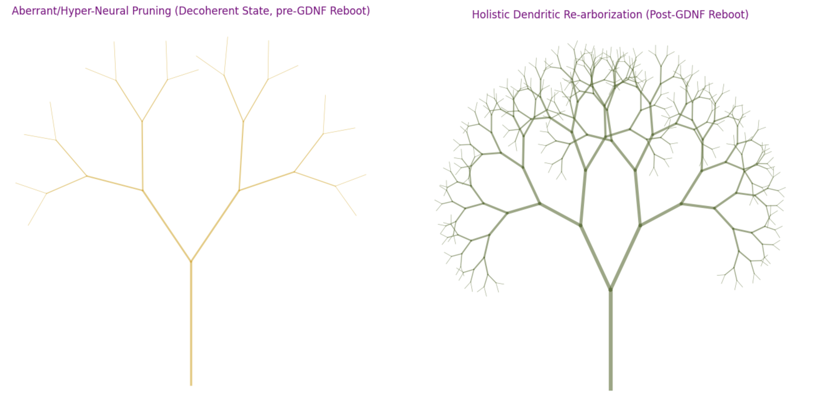

# $\color{indigo}{\text{The GDNF-Ibogaine Axis:}}$ $\color{indigo}{\text{A Systems-Biological Neurotrophic Rescue Model}}$

**Status:** In Progress / Literature Synthesis Phase  
**Researcher:** Julia Berman 🐘  
**Date:** March 2026  
**Subject:** Molecular Biology & Neurobiology

## $\color{mediumpurple}{\text{Abstract}}$

While ibogaine is traditionally characterized by its high dose 'reset' of dopaminergic circuits in addiction medicine, its capacity for Glial Cell-Derived Neurotrophic Factor ($\large{\textit{GDNF}}$) upregulation suggests a more nuanced application in development. This research proposes a shift from the high-dose 'flood' model of isolated ibogaine toward an integrated, whole-plant iboga framework for neurotrophic repair. By utilizing pulsed, sub-perceptual or low dosing, a hormetic approach analogous to Low-Dose Naltrexone (LDN), this model seeks to maximize $\large{\textit{GDNF}}$ expression while mitigating the $\large\textit{hERG}$ -related cardiac risks typically associated with isolated alkaloid 'floods.' This research posits the benefits of this can extend beyond addiction and PTSD models to include autism spectrum disorder (ASD), a disorder characterized by altered neural pruning and neurogenetics. This synthesis is intended for theoretical mapping of neurotrophic pathways and does not constitute medical advice or a protocol for personal experimentation.

This research explores the intersection of exogenous alkaloid administration and endogenous neurotrophic factor upregulation. Specifically, the capacity of ibogaine to induce Glial Cell-Derived Neurotrophic Factor (GDNF) is examined as a mechanism for inducing a "device firmware upgrade" of dopaminergic circuits. It is hypothesized that a pulsed, hormetic dosing schedule can achieve the same autoregulatory $\large{\textit{GDNF}}$ loop triggered by the 40 mg/kg threshold observed in preclinical rat models [[2]](#ref2). By maintaining a consistent neurotrophic signal below the $\large{\textit{hERG}}$ inhibition ceiling, this research aims to induce a self-sustaining, permanent 'firmware upgrade' of the reward system."

## $\color{mediumpurple}{\text{Introduction: The Bio-Harmonic Framework}}$

Ibogaine is an alkaloid derived from the shrub *Tabernanthe iboga*, which has been shown to upregulate $\large{\textit{GDNF}}$, which can be beneficial for systemic mental disorders such as post-traumatic stress disorder (PTSD) and addiction [[1]](#ref1). However, it carries significant cardiac risks, specifically via $\large{\textit{hERG}}$ channel inhibition, which necessitates a shift in focus toward low-dose hormetic protocols and pharmacological analogs [[1]](#ref1). This approach suggests that a quiet, steady presence of these compounds can nurture neural repair and $\large{\textit{GDNF}}$ expression without disturbing the heart's essential harmony.

The neural architecture is viewed here not as a static machine, but as a dynamic, resonant system. Using principles of molecular symmetry, the stability of indole-based scaffolds is analyzed in relation to microtubule-mediated signaling. This model prioritizes a synergistic priming phase, utilizing non-invasive modalities such as Hericium erinaceus biochemical supplementation, multimodal exercise, and mitochondrial photobiomodulation to create a fertile landscape for neurotrophic flourishing. "The 40 mg/kg 'flood' dose in rodent models is known to trigger a positive feedback loop where $\large{\textit{GDNF}}$ stimulates its own expression, leading to long-lasting neurological changes [[2]](#ref2). This study proposes that sub-perceptual, cumulative pulsing may reach this same transcriptional threshold through temporal summation. This would allow for a permanent transition to homeostatic equilibrium without the acute cardiac risks associated with high-dose isolated alkaloids.

## $\color{mediumpurple}{\text{Methodology}}$

### $\color{mediumpurple}{\text{The Recursive Dendrite Model}}$

This model posits that neurotrophic restoration follows a recursive growth algorithm. Unlike linear repair, where a stimulus leads to a fixed amount of growth, a recursive model suggests that each new dendritic branch increased by $\large{\textit{GDNF}}$ signaling serves as a new platform for further receptor expression.

| Stage | Mechanism | Biological / Structural Outcome |
| :--- | :--- | :--- |
| **1. Initial Pulse** | Sub-perceptual iboga alkaloids | Triggers primary $\large{\textit{GDNF}}$ release and receptor priming. |
| **2. Branching** | Dendritic arborization | Increased spine density and expanded $\textit{GFR}\alpha1$ receptor fields. |
| **3. Feedback** | Signal Amplification | Captured neurotrophins trigger the [He & Ron (2006)](https://doi.org/10.1096/fj.06-6394fje) autoregulatory loop. |
| **4. Stability** | Neural Homeostasis | The neural architecture becomes a self-maintaining, resilient system. |

## $\color{mediumpurple}{\text{Implications and Future Directions}}$

This framework posits that the benefits of pulsed, low-dose hormetic iboga may extend far beyond addiction recovery and dopamine signal normalization. Interestingly, autistic people have been shown to have lower levels of $GDNF$ gene expression, and lower levels correlate with more severe behavioral and cognitive deficits [[3]](#ref3). It is hypothesized that pulsed low levels of these alkaloids could theoretically lead to increased $GDNF$ expression through an imprinting-like topological and neurochemical mechanism. The low-dose nature of this framework could lessen the cardiac risk profile, though it still remains a serious concern. To test this, we could use iPSC organoid models of ASD and compare $GDNF$ expression before and after iboga alkaloid or analogue pulsed hormetic administration (using neurotypical organoids as a control group). To see if the effect persists over time, gene expression should be measured immediately among completing the dosing protocol, 1 month after, 3 months after, 6 months after, and 12 months after.

## $\color{mediumpurple}{\text{References}}$
1.  Nicolas M. (2025). Ibogaine's potential role in supporting reward system recovery across diagnostic boundaries. Frontiers in pharmacology, 16, 1744383. https://doi.org/10.3389/fphar.2025.1744383
2.  He, D. Y., & Ron, D. (2006). Autoregulation of glial cell line-derived neurotrophic factor expression: implications for the long-lasting actions of the anti-addiction drug, Ibogaine. FASEB journal : official publication of the Federation of American Societies for Experimental Biology, 20(13), 2420–2422. https://doi.org/10.1096/fj.06-6394fje
3.  Ali Raja, S., et al. (2024). Exploring the Mechanisms of Neuronal Protection by Glial Cell Line-Derived Neurotrophic Factor in Autism Spectrum Disorder. *Cureus*, *16*(10), e70913. https://doi.org/10.7759/cureus.70913
